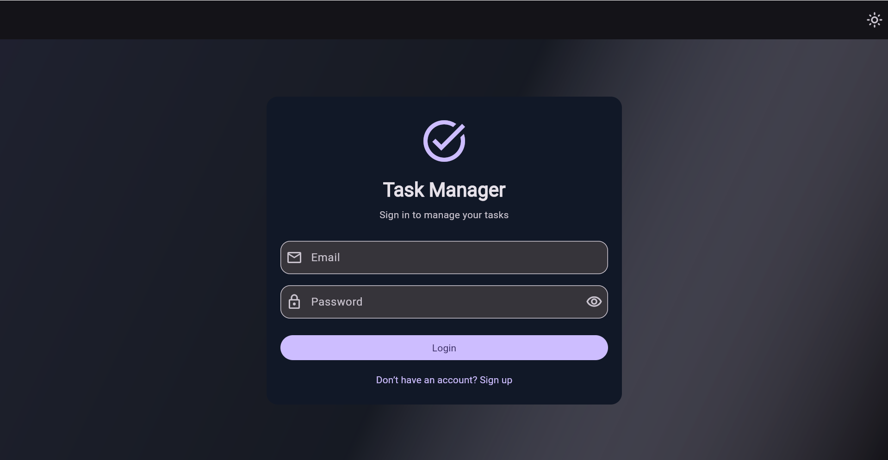
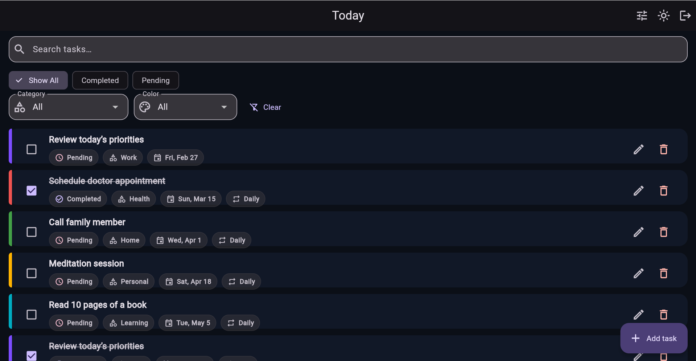
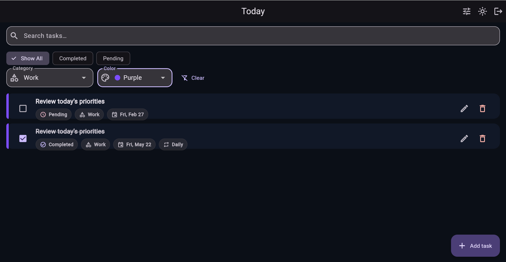
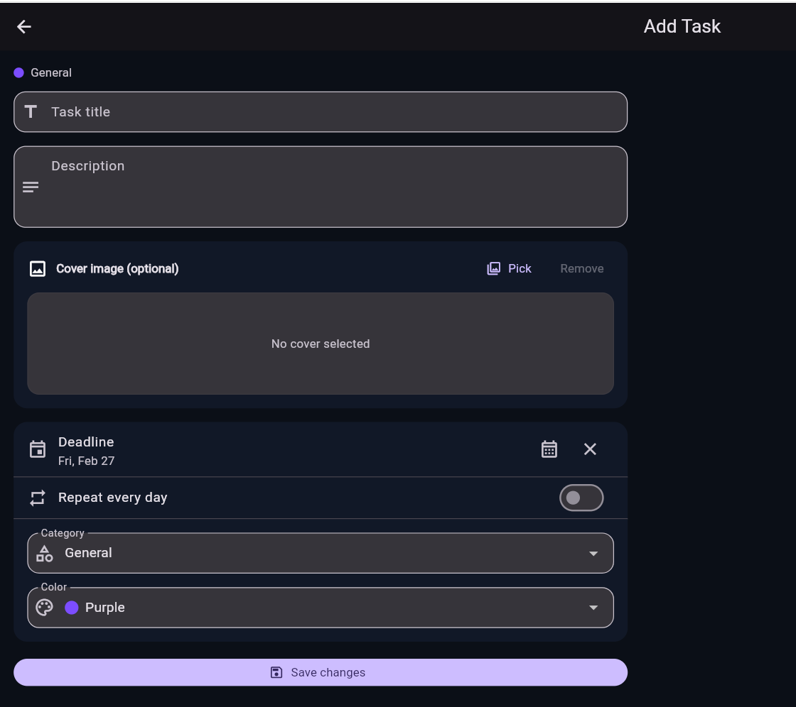
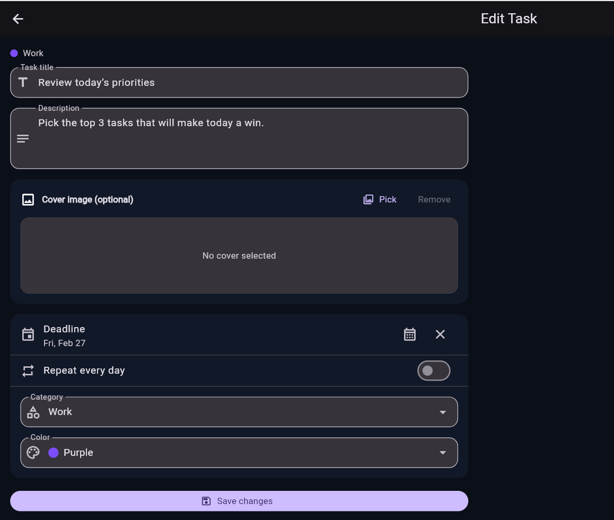

# Task Manager App

A Flutter app that displays tasks from [JSONPlaceholder](https://jsonplaceholder.typicode.com/todos) with a login screen (UI only), task list, and filter options.

---

## Project Overview

- **Login Screen**: Email and password form (UI only, no backend). Validates input and navigates to Home on "Login".
- **Home Screen**: Fetches tasks from the API, shows **Task Title** and **Completion Status** (Completed / Pending). Includes filter chips: **Show All**, **Completed**, **Pending**.
- **State**: Loading and error states are handled with retry on failure.
- **UI**: Material Design 3, responsive layout, clear spacing and typography.

---

## Tech Stack Used

| Category        | Technology / Package |
|----------------|----------------------|
| Framework      | Flutter              |
| Language       | Dart                 |
| State Management | [Provider](https://pub.dev/packages/provider) |
| HTTP Client    | [http](https://pub.dev/packages/http) |
| UI             | Material Design 3 (Flutter Material) |

---

## State Management Approach

- **Provider** is used for global task state.
- **TaskProvider** (extends `ChangeNotifier`) holds:
  - `tasks`: raw list from API
  - `filteredTasks`: list filtered by current filter (All / Completed / Pending)
  - `isLoading`, `error`, `filter`
- **TaskProvider** methods:
  - `loadTasks()`: fetches from API, sets loading/error
  - `setFilter(TaskFilter)`: updates filter and notifies listeners
- **Login** uses local `StatefulWidget` state (form fields, obscure password) only; no backend.

---

## Folder Structure

```
lib/
├── main.dart                 # App entry, theme, routes, Provider setup
├── models/
│   └── task_model.dart       # Task model from API (id, userId, title, completed)
├── providers/
│   └── task_provider.dart    # Task list state, filter, loadTasks()
├── screens/
│   ├── login_screen.dart     # Login UI (no backend)
│   └── home_screen.dart      # Task list + filter + loading/error
├── services/
│   └── task_service.dart     # HTTP fetch from JSONPlaceholder /todos
└── widgets/
    ├── filter_chips.dart     # Show All / Completed / Pending chips
    └── task_list_item.dart   # Single task row (title + status)
```

---

## Steps to Run the Project

1. **Prerequisites**
   - [Flutter SDK](https://docs.flutter.dev/get-started/install) installed and on `PATH`.
   - A device or emulator (Android/iOS/Chrome/Windows/macOS).

2. **Clone and open**
   ```bash
   git clone https://github.com/Samyuktha0507/Task_Manager.git
   cd task_manager_app
   ```

3. **Install dependencies**
   ```bash
   flutter pub get
   ```

4. **Run the app**
   ```bash
   flutter run
   ```
   Or select a device in your IDE and run from there.

5. **Usage**
   - On **Login**: enter any email and password (validation is UI-only), tap **Login**.
   - On **Home**: tasks load from the API. Use **Show All** / **Completed** / **Pending** to filter. Use the app bar logout icon to return to Login.

---

## Filters and task views

- **Show All**: displays every task returned from the API that matches any extra filters (search text, category, color).
- **Completed**: shows only tasks where the status is **Completed** (i.e. `completed == true`).
- **Pending**: shows only tasks where the status is **Pending** (`completed == false`).
- **Extra filters**: you can also narrow tasks by **category**, **color**, or by typing in the **search** box; all filters combine together.

---

## App Screenshots

*(Add your own screenshots after running the app.)*

### Login Screen

<!-- Replace the path with your screenshot path, e.g. screenshots/login.png -->


### Home Screen (all tasks)



### Filtered View (e.g. Completed or Pending)



### Add Task Screen



### Edit Task Screen



---

## Device / Emulator Used for Testing

- **Device/Emulator**: Chrome (Flutter Web)
- **OS**: Windows 11

*(Fill this in after you run and test the app.)*

---

## API Reference

- Tasks are fetched from: **https://jsonplaceholder.typicode.com/todos**
- Each item has: `id`, `userId`, `title`, `completed` (boolean).

---

## License

This project is for educational/demo purposes.
